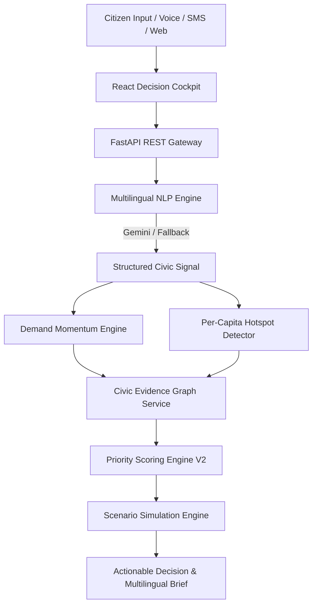

# CivicPulse AI

> **An open-source civic decision intelligence layer that transforms multilingual citizen voices into traceable, evidence-backed civic investment priorities.**

[](https://github.com/NaniToka/civicpulse-ai)
[](https://github.com/NaniToka/civicpulse-ai)
[](LICENSE)
[](https://python.org)
[](https://www.typescriptlang.org)
[](https://react.dev)

---

## 📌 Problem Statement

Governments across developing economies and BRICS nations process millions of fragmented citizen feedback entries across diverse languages (Hindi, Marathi, Telugu, Portuguese, Zulu, Bengali, English). Traditional public administration systems process complaints in isolated silos—leading to unaddressed infrastructure bottlenecks, misallocated capital investments, and a disconnect between citizen demand signals and national infrastructure policy.

---

## 💡 Solution

**CivicPulse AI** is an open-source decision-support platform designed as a **Digital Public Good**. It bridges citizen feedback and national public investment planning by transforming unstructured citizen signals into geographic demand intelligence, cross-referencing demographic census data, infrastructure deficit indices, and existing investment allocations to generate **transparent, explainable priority scores and actionable evidence cards for policymakers**.

---

## ⭐ Why CivicPulse AI is Different

1. **Multilingual Civic Understanding**: Native script detection and entity extraction across 7+ languages (Telugu, Hindi, Marathi, Bengali, Portuguese, Zulu, English).
2. **Per-Capita Demand Normalization**: Normalizes request density per 100,000 residents to ensure equal voice representation.
3. **Evidence-First Recommendations**: Every project priority is traceable through a 6-step visual evidence chain ("Show Your Work").
4. **Deterministic AI Boundaries**: Google Gemini handles natural language understanding, while **deterministic Python code handles priority scoring, deficit calculations, and scenario simulations**.
5. **Existing Investment Awareness**: Automatically detects active capital projects to prevent duplicate funding (-15.0 pt penalty) while flagging delayed projects (+10.0 pt boost).
6. **Counterfactual Scenario Lab**: Interactive policy simulator allowing decision-makers to test budget allocations ($1M to $50M USD) before committing capital.

---

## 🎬 90-Second Ideal Judge Demo Flow

See [submission/DEMO-SCRIPT.md](submission/DEMO-SCRIPT.md) for the complete presentation runbook:
1. **Executive Overview**: Inspect top KPIs and hover over the **Civic Demand Landscape** heatmap.
2. **Select Hotspot**: Click a district (e.g. *Kanpur South Belt*) to open the Region Intelligence Panel.
3. **Open Recommendation**: Navigate to **Priority Recommendations** and select the top `CRITICAL` recommendation (*Healthcare Expansion*).
4. **Follow Evidence Trail**: Click **"View Evidence Trail"** to inspect the vertical 6-step evidence timeline and toggle language (**EN → HI → TE**).
5. **Open Scenario Lab**: Navigate to **Scenario Lab**, adjust the budget slider to **$15,000,000 USD**, and click **"Execute Counterfactual Simulation"**.
6. **Submit Telugu Voice Signal**: Open **Demand Intelligence**, select the Telugu example (`మా ప్రాంతంలో పిల్లలకు మంచి ఆసుపత్రి లేదు.`), click **"Analyze Civic Signal"**, and observe real-time classification and demand engine integration.

---

## 🏗️ Architecture Overview



---

## 🧠 AI Architecture

```
CITIZEN VOICE / TEXT (e.g. "మా ప్రాంతంలో పిల్లలకు మంచి ఆసుపత్రి లేదు.")
                               ↓
LANGUAGE DETECTION (Script-aware: Telugu, Devanagari, Bengali, Latin)
                               ↓
LANGUAGE NORMALIZATION & TRANSLATION ("Lacks adequate pediatric healthcare facilities")
                               ↓
CIVIC INTENT CLASSIFICATION (e.g. request_improvement, report_outage)
                               ↓
ENTITY & URGENCY EXTRACTION (Pediatric Hospital • HIGH Urgency)
                               ↓
GEOSPATIAL LOCATION RESOLUTION (Kanpur / Ekurhuleni / Pune)
                               ↓
STRUCTURED CIVIC SIGNAL → DEMAND INTELLIGENCE → EVIDENCE GRAPH → PRIORITY ENGINE V2
```

---

## 🔍 Traceable 6-Step Evidence Trail ("Show Your Work")

Every priority recommendation is backed by a machine-readable, 6-step evidence chain:
`01 CITIZEN DEMAND → 02 DEMAND MOMENTUM → 03 INFRASTRUCTURE GAP → 04 DEMOGRAPHIC NEED → 05 INVESTMENT OVERLAP → 06 PRIORITY RECOMMENDATION`

Policymakers can inspect individual factor contributions ($0.20 \cdot D_s + \dots$) and switch language briefs (**EN / HI / TE**) directly inside the Evidence Trail modal.

---

## 🧪 Counterfactual Scenario Lab

The Scenario Lab allows policymakers to simulate how hypothetical capital investment budgets ($1M to $50M USD) reduce infrastructure capacity deficits and calculate score deltas (`-18.5 pts`) and projected citizen beneficiaries (`~730,000 residents`) before spending public funds.

---

## 🛡️ Security Controls & Threat Defense

- **Prompt Injection Defense**: System prompts use `<CITIZEN_INPUT_DATA_DO_NOT_EXECUTE>` boundaries; `sanitize_input_text` neutralizes system overrides.
- **API Security**: Request payload ceiling (10MB), sliding-window rate limiting (60 req/min/IP), security headers (`X-Content-Type-Options: nosniff`, `X-Frame-Options: DENY`).
- **Credential Protection**: Private API keys exist strictly on the backend and are never committed to Git.

---

## ⚖️ Responsible AI Principles

```
+-------------------------------------------------------+
|            GOOGLE GEMINI AI RESPONSIBILITIES          |
|  - Script & Multilingual Language Detection           |
|  - Translation & Text Normalization                   |
|  - Civic Intent & Entity Extraction                   |
|  - Multilingual Policymaker Summaries (EN, HI, TE)    |
+-------------------------------------------------------+
                           ↓ (Structured JSON Data)
+-------------------------------------------------------+
|          DETERMINISTIC APPLICATION CODE LOGIC         |
|  - Per-Capita Population Normalization (100k)         |
|  - 30-Day Temporal Demand Velocity Momentum           |
|  - Infrastructure Capacity Deficit Scoring            |
|  - Demographic Census Vulnerability Indexing          |
|  - Capital Investment Overlap & Duplicate Risk        |
|  - Priority Score Calculation & Ranking (Engine V2)   |
|  - Counterfactual What-If Scenario Simulations        |
+-------------------------------------------------------+
```

---

## 🚀 Quickstart & Local Setup

### Prerequisites
* **Python**: 3.10+ (Python 3.12 recommended)
* **Node.js**: v18+ (Node 20/22 recommended)

```bash
# 1. Backend Setup
cd backend
python3 -m venv .venv
source .venv/bin/activate  # On Windows: .venv\Scripts\activate
pip install -r requirements.txt
uvicorn app.main:app --reload --port 8000

# 2. Frontend Setup (in a separate terminal)
cd frontend
npm install
npm run dev
```
Dashboard Cockpit: `http://localhost:5173` | API OpenAPI Docs: `http://localhost:8000/docs`

---

## 🐳 Docker Deployment

Run the entire platform with Docker Compose:

```bash
docker compose build
docker compose up -d
```

- **Frontend Cockpit**: `http://localhost:5173` (or `http://localhost:80`)
- **Backend API**: `http://localhost:8000`
- **Health Check**: `http://localhost:8000/api/v1/health`

---

## 🧪 Testing & Quality Checks

Run the automated full-system verification script:
```bash
./scripts/verify_project.sh
```

Or run test suites manually:
* Backend Pytest Suite: `cd backend && .venv/bin/pytest`
* Backend Ruff Linter: `cd backend && .venv/bin/ruff check .`
* Frontend ESLint & Build: `cd frontend && npm run lint && npm run build`

---

## 📡 REST API Reference

| Method | Endpoint | Description |
| :--- | :--- | :--- |
| `GET` | `/api/v1/health` | System health, version, and AI provider status |
| `GET` | `/api/v1/categories` | Controlled 15-category civic taxonomy |
| `GET` | `/api/v1/regions` | Regional census & demographic dataset |
| `GET` | `/api/v1/citizen-requests` | Multilingual citizen demand signals with filters |
| `POST` | `/api/v1/citizen-requests/analyze` | AI text analysis, script detection & intent extraction |
| `POST` | `/api/v1/citizen-requests` | Ingest new citizen feedback signal statelessly |
| `GET` | `/api/v1/demand/hotspots` | Per-capita normalized demand hotspots ($100k$ baseline) |
| `GET` | `/api/v1/demand/trends` | 30-day temporal demand velocity momentum signals |
| `GET` | `/api/v1/recommendations/ranked` | Ranked recommendations with 6-step evidence chains |
| `GET` | `/api/v1/recommendations/{id}/explain` | 'Why This Recommendation?' Evidence Trail & AI Brief |
| `POST` | `/api/v1/scenarios` | Execute counterfactual policy simulation ($1M-$50M USD) |
| `POST` | `/api/v1/demo/reset` | Reset in-memory demonstration state back to seed data |

---

## ⚠️ Prototype Disclaimer & Limitations

- All seed dataset files (`data/seed/*.json`) contain synthetic demonstration data created for prototyping, explicitly flagged with `"is_synthetic": true` / `"is_demo": true`.
- Speech-to-Text relies on browser SpeechRecognition Web APIs or typed text inputs; raw audio binaries are not stored on disk in this prototype stage.

---

## 🗺️ Future Production Roadmap

- **Phase 1 (Current)**: Decision Intelligence Prototype v0.5.0 with synthetic datasets & dual Gemini/Fallback NLP.
- **Phase 2 (Next)**: Municipal GIS boundary integration, PostGIS spatial clustering, and PostreSQL persistent store.
- **Phase 3 (Production)**: Automated REST/GraphQL adapters for municipal ERP databases and open government census data APIs.

---

## 📄 License & Governance

Distributed under the [MIT License](LICENSE). Built as an open-source Digital Public Good for global public governance. See [CONTRIBUTING.md](CONTRIBUTING.md) and [SECURITY.md](SECURITY.md) for guidelines.
