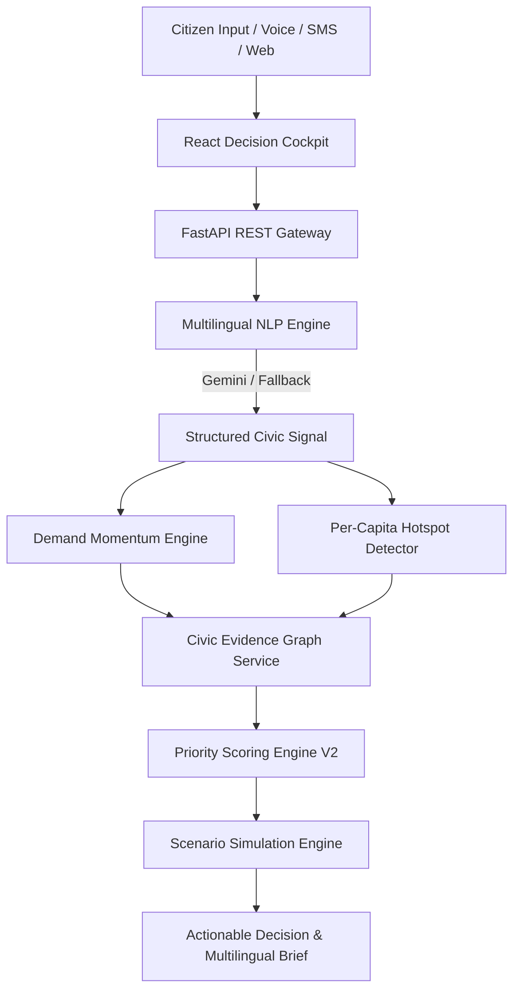

# CivicPulse AI

> **AI-Powered Civic Decision Intelligence Platform**  
> *Track 1 — AI for Digital Public Infrastructure & Governance (BRICS Nations)*

[](https://github.com/NaniToka/civicpulse-ai)
[](https://github.com/NaniToka/civicpulse-ai)
[](LICENSE)
[](https://python.org)
[](https://www.typescriptlang.org)
[](https://react.dev)

---

## 📌 The Governance Problem

Governments across developing economies and BRICS nations process millions of fragmented citizen feedback entries across diverse languages (Hindi, Marathi, Telugu, Portuguese, Zulu, Bengali, Russian, Mandarin, English). Traditional public administration systems process complaints in isolated silos—leading to unaddressed infrastructure bottlenecks, misallocated capital investments, and a disconnect between citizen demand signals and national infrastructure policy.

**CivicPulse AI** is an open-source, scalable, decision-support platform designed as a **Digital Public Good**. It bridges citizen feedback and national public investment planning by transforming unstructured citizen signals into geographic demand intelligence, cross-referencing demographic data, infrastructure deficit indices, and existing investment allocations to generate **transparent, explainable priority scores and actionable evidence cards for policymakers**.

> ⚠️ **Data & Prototype Disclaimer**: All seed dataset files (`data/seed/*.json`) and demonstration API responses contain synthetic data created solely for prototyping and verification purposes, explicitly flagged with `"is_synthetic": true` / `"is_demo": true`.

---

## 🗣️ Multilingual Civic Intelligence Engine

CivicPulse AI accepts unstructured citizen feedback in multiple languages (Telugu, Hindi, Marathi, Bengali, Portuguese, Zulu, English) and converts it into structured, actionable civic signals:

```
CITIZEN VOICE / TEXT (e.g. "మా ప్రాంతంలో పిల్లలకు మంచి ఆసుపత్రి లేదు.")
                               ↓
LANGUAGE DETECTION (Script-aware: Telugu, Devanagari, Bengali, Latin)
                               ↓
LANGUAGE NORMALIZATION & TRANSLATION ("Lacks adequate pediatric healthcare facilities")
                               ↓
CIVIC INTENT CLASSIFICATION (e.g. request_improvement, report_outage)
                               ↓
ENTITY & URGENCY EXTRACTION (Pediatric Hospital • HIGH Urgency)
                               ↓
GEOSPATIAL LOCATION RESOLUTION (Kanpur / Ekurhuleni / Pune)
                               ↓
STRUCTURED CIVIC SIGNAL → DEMAND INTELLIGENCE → EVIDENCE GRAPH → PRIORITY ENGINE V2
```

---

## ⭐ Why CivicPulse AI is Different

1. **Multilingual Civic Understanding**: Native script detection and entity extraction across 7+ languages (Telugu, Hindi, Marathi, Bengali, Portuguese, Zulu, English).
2. **Evidence-First Recommendations**: Every project priority is traceable through a 6-step visual evidence chain ("Show Your Work").
3. **Deterministic AI Boundaries**: Google Gemini handles natural language understanding, while **deterministic Python code handles priority scoring, deficit calculations, and scenario simulations**.
4. **Existing Investment Awareness**: Automatically detects active capital projects to prevent duplicate funding (-15.0 pt penalty) while flagging delayed projects (+10.0 pt boost).
5. **Counterfactual Scenario Lab**: Interactive policy simulator allowing decision-makers to test budget allocations ($1M to $50M USD) before committing capital.
6. **Responsible AI & Prompt Injection Defense**: System prompts use `<CITIZEN_INPUT_DATA_DO_NOT_EXECUTE>` boundaries to prevent LLM jailbreaks or secret exfiltration.

---

## 🏗️ System Architecture



---

## 🛡️ Responsible AI & Security Controls

```
+-------------------------------------------------------+
|            GOOGLE GEMINI AI RESPONSIBILITIES          |
|  - Script & Multilingual Language Detection           |
|  - Translation & Text Normalization                   |
|  - Civic Intent & Entity Extraction                   |
|  - Multilingual Policymaker Summaries (EN, HI, TE)    |
+-------------------------------------------------------+
                           ↓ (Structured JSON Data)
+-------------------------------------------------------+
|          DETERMINISTIC APPLICATION CODE LOGIC         |
|  - Per-Capita Population Normalization (100k)         |
|  - 30-Day Temporal Demand Velocity Momentum           |
|  - Infrastructure Capacity Deficit Scoring            |
|  - Demographic Census Vulnerability Indexing          |
|  - Capital Investment Overlap & Duplicate Risk        |
|  - Priority Score Calculation & Ranking (Engine V2)   |
|  - Counterfactual What-If Scenario Simulations        |
+-------------------------------------------------------+
```

- **API Security**: Request payload ceiling (10MB), sliding-window rate limiting (60 req/min/IP), security headers (`X-Content-Type-Options: nosniff`, `X-Frame-Options: DENY`).
- **Credential Protection**: Private API keys exist strictly on the backend and are never committed to Git.

---

## 🖥️ Product Experience & Main Workspace Views

1. **Executive Overview** (`/`): High-level executive KPIs, interactive "Civic Demand Landscape" regional heatmap, Live Signal Ticker, Top Priority Actions, and Featured Evidence Preview.
2. **Demand Intelligence** (`/demand`): Interactive `CitizenVoiceComposer` for real-time multilingual feedback input, category demand distribution, 30-day temporal demand velocity signals (`INCREASING`, `STABLE`, `EMERGING`), and language representation metrics.
3. **Demand Hotspots** (`/hotspots`): Per-capita normalized demand concentration ($100,000$ residents baseline), selected Region Intelligence Panel, and sortable Municipal Hotspot Ranking Table.
4. **Infrastructure Gaps** (`/gaps`): Operational capacity deficit index overview and Region × Sector Deficit Heat Matrix (0.00 to 1.00 intensity).
5. **Priority Recommendations** (`/recommendations`): Ranked evidence-backed capital priorities, filterable cards (`CRITICAL`, `HIGH`, `MEDIUM`, `LOW`), score badges, and evidence trail triggers.
6. **Evidence Explorer** (`/evidence`): Searchable granular evidence nodes (`citizen_demand`, `infrastructure_gap`, `demographic_need`, `investment_context`), confidence metrics, and 6-step recommendation chains.
7. **Scenario Lab** (`/scenarios`): Interactive counterfactual policy simulator allowing budget allocation ($1M to $50M USD) and coverage target adjustments with Before/After score deltas and beneficiary projections.
8. **Data Explorer** (`/data`): Synthetic demonstration dataset inspector (Requests, Regions, Indicators, Investments) and live multilingual citizen request ingestion testing.

---

## 🚀 Quickstart & Local Setup

### Prerequisites
* **Python**: 3.10+ (Python 3.12 recommended)
* **Node.js**: v18+ (Node 20/22 recommended)
* **Docker & Docker Compose**: (Optional, for containerized deployment)

---

### Option A: Local Development Setup

#### 1. Backend Setup
```bash
cd backend

# Create virtual environment
python3 -m venv .venv
source .venv/bin/activate  # On Windows: .venv\Scripts\activate

# Install dependencies
pip install -r requirements.txt

# Run backend development server
uvicorn app.main:app --reload --port 8000
```
API OpenAPI Documentation will be live at: `http://localhost:8000/docs`

#### 2. Frontend Setup
```bash
cd frontend

# Install Node modules
npm install

# Start Vite dev server
npm run dev
```
Dashboard Cockpit will be live at: `http://localhost:5173`

---

### Option B: Docker Containerized Setup

Run the entire platform with Docker Compose:

```bash
# Build and start services
docker compose build
docker compose up -d
```

- **Frontend Application**: `http://localhost:5173` (or `http://localhost:80`)
- **Backend API**: `http://localhost:8000`
- **Health Check**: `http://localhost:8000/api/v1/health`

To stop containers:
```bash
docker compose down
```

---

## 🧪 Verification & Quality Checks

Run the automated full-system verification script:
```bash
./scripts/verify_project.sh
```

Or run test suites manually:
* Backend Unit & AI Tests: `cd backend && .venv/bin/pytest`
* Backend Linting: `cd backend && .venv/bin/ruff check .`
* Frontend Linting & Build: `cd frontend && npm run lint && npm run build`

---

## 🎬 90-Second Ideal Judge Demo Flow

See [docs/judge-demo.md](docs/judge-demo.md) for the complete presentation runbook:
1. **Executive Overview**: Inspect top KPIs and hover over the **Civic Demand Landscape**.
2. **Select Hotspot**: Click a district (e.g. *Kanpur South Belt*) to open the Region Intelligence Panel.
3. **Open Recommendation**: Navigate to **Priority Recommendations** and select the top `CRITICAL` recommendation (*Healthcare Expansion*).
4. **Follow Evidence Trail**: Click **"View Evidence Trail"** to inspect the vertical 6-step evidence timeline and toggle language (EN → HI → TE).
5. **Open Scenario Lab**: Navigate to **Scenario Lab**, adjust the budget slider to **$15,000,000 USD**, and click **"Execute Counterfactual Simulation"**.
6. **Submit Telugu Voice Signal**: Open **Demand Intelligence**, select the Telugu example (`మా ప్రాంతంలో పిల్లలకు మంచి ఆసుపత్రి లేదు.`), click **"Analyze Civic Signal"**, and observe real-time classification and demand engine integration.

---

## 📡 REST API Reference

| Method | Endpoint | Description |
| :--- | :--- | :--- |
| `GET` | `/api/v1/health` | System health, version, and AI provider status |
| `GET` | `/api/v1/categories` | Controlled 15-category civic taxonomy |
| `GET` | `/api/v1/regions` | Regional census & demographic dataset |
| `GET` | `/api/v1/citizen-requests` | Multilingual citizen demand signals with filters |
| `POST` | `/api/v1/citizen-requests/analyze` | AI text analysis, script detection & intent extraction |
| `POST` | `/api/v1/citizen-requests` | Ingest new citizen feedback signal statelessly |
| `GET` | `/api/v1/demand/hotspots` | Per-capita normalized demand hotspots ($100k$ baseline) |
| `GET` | `/api/v1/demand/trends` | 30-day temporal demand velocity momentum signals |
| `GET` | `/api/v1/recommendations/ranked` | Ranked recommendations with 6-step evidence chains |
| `GET` | `/api/v1/recommendations/{id}/explain` | 'Why This Recommendation?' Evidence Trail & AI Brief |
| `POST` | `/api/v1/scenarios` | Execute counterfactual policy simulation ($1M-$50M USD) |
| `POST` | `/api/v1/demo/reset` | Reset in-memory demonstration state back to seed data |

---

## 📄 License & Open Source Governance

Distributed under the [MIT License](LICENSE). Built as an open-source Digital Public Good for global public governance. See [CONTRIBUTING.md](CONTRIBUTING.md) and [SECURITY.md](SECURITY.md) for contribution and security reporting guidelines.
