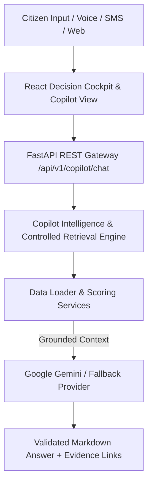

# 🏛️ CivicPulse AI (v2.0)

> **An open-source multilingual civic decision intelligence layer that transforms citizen voices across Indian states into traceable, evidence-backed civic investment priorities.**

[](https://github.com/NaniToka/civicpulse-ai)
[](https://github.com/NaniToka/civicpulse-ai)
[](https://www.typescriptlang.org)
[](https://react.dev)
[](https://vitejs.dev)
[](https://fastapi.tiangolo.com)
[](LICENSE)

---

## 📌 Problem Statement

Public administration systems across India process millions of fragmented citizen complaints across diverse regional scripts (*Hindi, Telugu, Tamil, Marathi, Punjabi, Bengali, Kannada, Gujarati, Malayalam, Odia, Urdu, English*). Traditional municipal systems process complaints in isolated silos—leading to unaddressed infrastructure bottlenecks, misallocated capital investments, and a disconnect between citizen demand signals and municipal budget allocation.

---

## 💡 Solution

**CivicPulse AI** is an open-source decision-support platform built as a **Digital Public Good**. It bridges citizen feedback and municipal public investment planning by transforming unstructured citizen signals into geographic demand intelligence, cross-referencing demographic census data, infrastructure deficit indices, and existing investment allocations to generate **transparent, explainable priority scores and actionable evidence cards for decision-makers**.

---

## ⭐ Core Pillars & Features

| Feature | Description | Highlight |
| :--- | :--- | :--- |
| 🤖 **Civic Intelligence Copilot** | Grounded conversational AI assistant (`/copilot`) for natural-language questions, evidence citations, CivicFund project funding gap queries, and $15M scenario execution. | `CopilotView.tsx` & `/api/v1/copilot/chat` |
| 🇮🇳 **35 Indian Districts Dataset** | Seed dataset covering 35 municipal districts across Indian states with demographic census metrics and vulnerability indices. | *Kanpur UP, Pune MH, Chennai TN, Ongole AP, Delhi NCR, Mumbai MH, Ludhiana PB, Bengaluru KA, Hyderabad TG, Kolkata WB, etc.* |
| 🧊 **3D Isometric Donut Chart** | 3D isometric cylinder ring visualization featuring perspective transforms, multi-layered SVG extrusions, and 60fps momentum spin. | `ThreeDDonutChart.tsx` |
| 📊 **3D Animated Bar Matrix Graph** | 3D extruded bar cylinder graph visualizing system dataset volume with upright 2D glass hover badges. | `ThreeDBarChart.tsx` |
| 💬 **Citizen Feedback Wall** | Live community feedback wall featuring citizen posts across Indian states with positive praise 🎉, critical alerts 🚨, star ratings, emoji toolbar, and single-upvote toggle logic. | `CitizenFeedbackWall.tsx` |
| 🌡️ **Infrastructure Deficit Matrix** | Cell matrix with explicit deficit scores (`0.00 – 1.00`), capacity shortfall % labels, and color-coded severity badges (`CRITICAL 🚨`, `HIGH ⚠️`, `STABLE ✅`). | `InfrastructureGaps.tsx` |
| 🔬 **Scenario Lab Simulator** | Counterfactual policy simulator with 1-click intervention presets, dual priority reduction gauge cards, and cost-per-resident ROI metrics. | `WhatIfScenario.tsx` |
| 📱 **Mobile & Laptop Responsive** | Glassmorphic navigation drawer overlay, responsive grid layouts, and mobile-friendly touch targets across all devices. | `Navbar.tsx` & `Sidebar.tsx` |


---

## 📐 Architecture Overview




---

## 🧠 Responsible AI & Deterministic Boundary

To ensure strict accountability in public governance, **CivicPulse AI** enforces a strict boundary between AI natural language processing and deterministic calculation logic:

```
+-------------------------------------------------------+
|            GOOGLE GEMINI AI RESPONSIBILITIES          |
|  - Regional Script & Multilingual Detection           |
|  - Text Translation & Intent Classification           |
|  - Entity & Urgency Extraction                        |
|  - Multilingual Policymaker Summaries (EN, HI, TE)    |
+-------------------------------------------------------+
                           ↓ (Structured JSON Signals)
+-------------------------------------------------------+
|          DETERMINISTIC APPLICATION CODE LOGIC         |
|  - Per-Capita Population Normalization (100k)         |
|  - 30-Day Temporal Demand Velocity Momentum           |
|  - Infrastructure Capacity Deficit Scoring            |
|  - Demographic Census Vulnerability Indexing          |
|  - Capital Investment Overlap & Duplicate Penalty     |
|  - Priority Score Calculation & Ranking (Engine V2)   |
|  - Counterfactual What-If Policy Simulations          |
+-------------------------------------------------------+
```

---

## 🔍 Traceable 6-Step Evidence Trail ("Show Your Work")

Every priority recommendation generated by CivicPulse AI is backed by a machine-readable 6-step evidence chain:

$$\text{Priority Score} = 0.35 \cdot S_{\text{demand}} + 0.25 \cdot I_{\text{gap}} + 0.20 \cdot V_{\text{demographic}} + 0.20 \cdot O_{\text{investment}}$$

```
01 CITIZEN DEMAND → 02 DEMAND MOMENTUM → 03 INFRASTRUCTURE GAP → 04 DEMOGRAPHIC NEED → 05 INVESTMENT OVERLAP → 06 PRIORITY RECOMMENDATION
```

Policymakers can inspect individual factor contributions and switch language briefs (**EN / HI / TE**) directly inside the Evidence Explorer.

---

## 🚀 Quickstart & Local Setup

### Prerequisites
* **Python**: 3.10+ (Python 3.12 recommended)
* **Node.js**: v18+ (Node 20/22 recommended)

### 1. Backend Setup
```bash
cd backend
python3 -m venv .venv
source .venv/bin/activate  # On Windows: .venv\Scripts\activate
pip install -r requirements.txt
uvicorn app.main:app --reload --port 8000
```

### 2. Frontend Setup (in a separate terminal)
```bash
cd frontend
npm install
npm run dev
```

- **Dashboard Cockpit**: `http://localhost:5173`
- **API OpenAPI Docs**: `http://localhost:8000/docs`

---

## 🌐 Production Deployment (Render Blueprint)

CivicPulse AI is configured for dual-service production deployment on **Render** via the repository-native `render.yaml` Blueprint:

### Service Architecture
* **Service 1 (Backend)**: `civicpulse-ai-backend` — Python FastAPI Web Service bound to `0.0.0.0:$PORT` with health checks on `/api/v1/health`.
* **Service 2 (Frontend)**: `civicpulse-ai-frontend` — React Static Site built via `npm ci && npm run build` publishing `./frontend/dist`.

### Deployment Steps
1. Connect your GitHub repository to [Render](https://render.com).
2. Click **New +** → **Blueprint** and select `render.yaml`.
3. Configure Backend Environment Secret: `GEMINI_API_KEY` (stored securely in Render dashboard).
4. Set Backend `ALLOWED_CORS_ORIGINS` to `https://<YOUR-FRONTEND-URL>.onrender.com`.
5. Set Frontend `VITE_API_BASE_URL` to `https://<YOUR-BACKEND-URL>.onrender.com`.
6. Verify backend health check endpoint at `/api/v1/health` and open the public frontend URL.

---

## 🐳 Docker Deployment

Run the complete stack via Docker Compose:

```bash
docker compose build
docker compose up -d
```

- **Frontend Cockpit**: `http://localhost:5173` (or `http://localhost:80`)
- **Backend API**: `http://localhost:8000`
- **Health Check**: `http://localhost:8000/api/v1/health`

---

## 🧪 Testing & Quality Checks

Run the automated full-system verification script:
```bash
./scripts/verify_project.sh
```

Or run test suites individually:
* **Backend Pytest Suite**: `cd backend && .venv/bin/pytest`
* **Backend Ruff Linter**: `cd backend && .venv/bin/ruff check .`
* **Frontend ESLint & Build**: `cd frontend && npm run lint && npx tsc --noEmit && npm run build`

---

## 📡 REST API Reference

| Method | Endpoint | Description |
| :--- | :--- | :--- |
| `GET` | `/api/v1/health` | System health, version, and AI provider status |
| `GET` | `/api/v1/categories` | Controlled 15-category civic taxonomy |
| `GET` | `/api/v1/regions` | 35 Indian regional census & demographic dataset |
| `GET` | `/api/v1/citizen-requests` | Multilingual citizen demand signals with filters |
| `POST` | `/api/v1/citizen-requests/analyze` | AI text analysis, script detection & intent extraction |
| `POST` | `/api/v1/citizen-requests` | Ingest new citizen feedback signal statelessly |
| `GET` | `/api/v1/demand/hotspots` | Per-capita normalized demand hotspots ($100\text{k}$ baseline) |
| `GET` | `/api/v1/demand/trends` | 30-day temporal demand velocity momentum signals |
| `GET` | `/api/v1/recommendations/ranked` | Ranked recommendations with 6-step evidence chains |
| `GET` | `/api/v1/recommendations/{id}/explain` | 'Why This Recommendation?' Evidence Trail & AI Brief |
| `POST` | `/api/v1/scenarios` | Execute counterfactual policy simulation ($1\text{M}-\$50\text{M}$ USD) |
| `POST` | `/api/v1/demo/reset` | Reset in-memory demonstration state back to seed data |

---

## 📄 License & Governance

Distributed under the [MIT License](LICENSE). Built as an open-source Digital Public Good for public governance. See [CONTRIBUTING.md](CONTRIBUTING.md) and [SECURITY.md](SECURITY.md) for guidelines.
