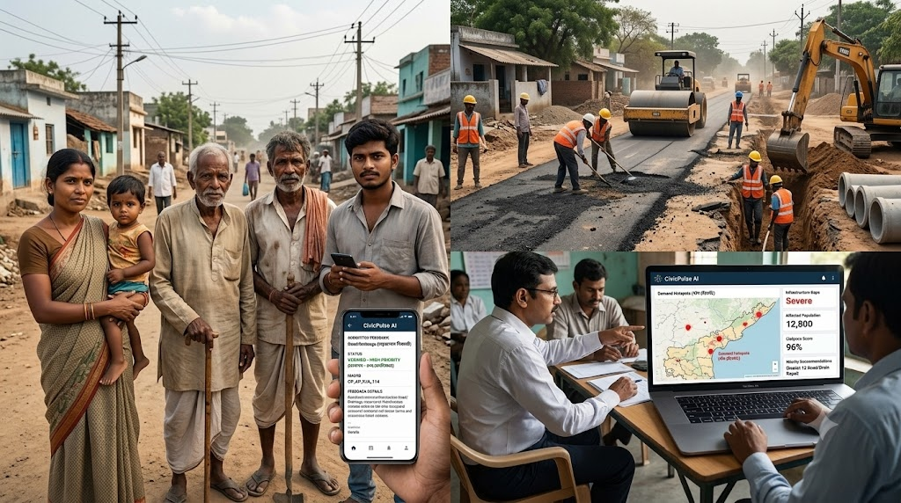
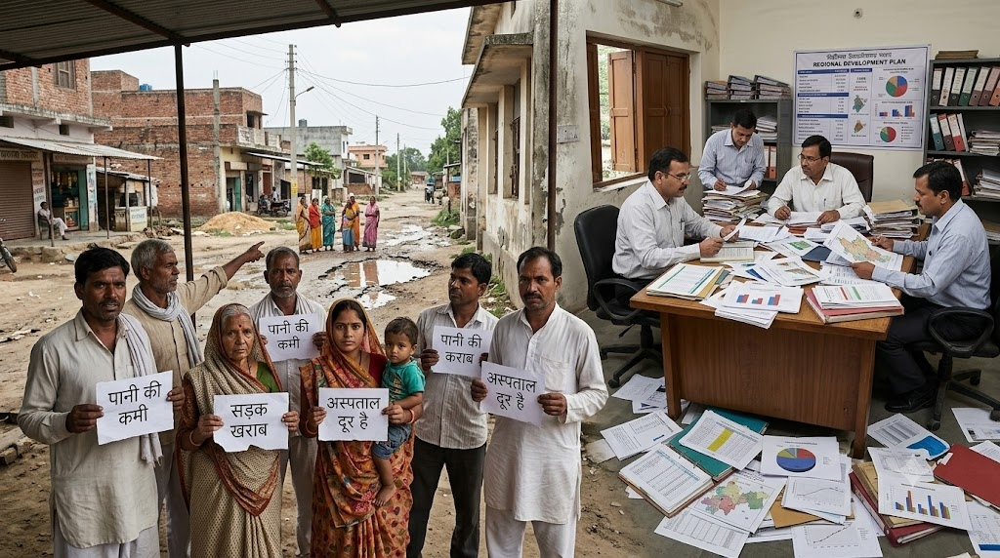
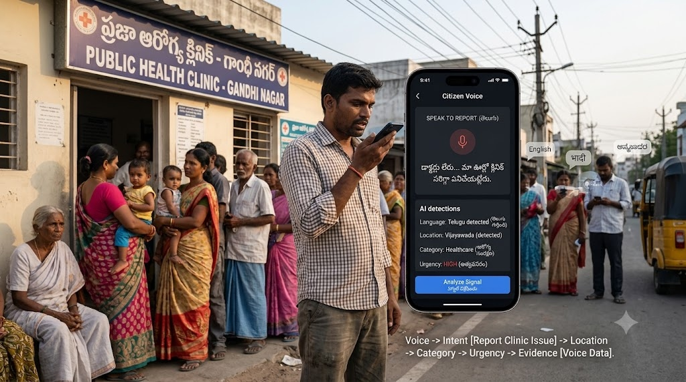
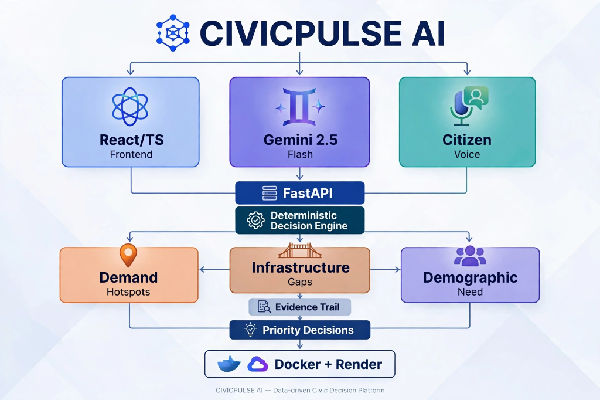
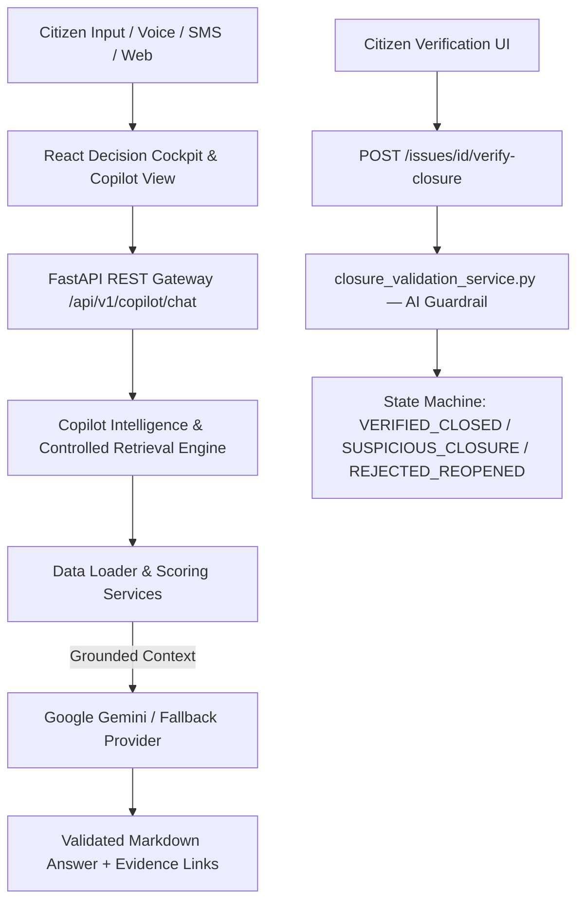

# 🏛️ CivicPulse AI (v2.0)

<div align="center">
  
</div>
<br/>

> **An open-source multilingual civic decision intelligence layer that transforms citizen voices across Indian states into traceable, evidence-backed civic investment priorities.**

[](https://github.com/NaniToka/civicpulse-ai)
[](https://github.com/NaniToka/civicpulse-ai)
[](https://www.typescriptlang.org)
[](https://react.dev)
[](https://vitejs.dev)
[](https://fastapi.tiangolo.com)
[](LICENSE)

---

## 📌 Problem Statement

<div align="center">
  
</div>
<br/>

Public administration systems across India process millions of fragmented citizen complaints across diverse regional scripts (*Hindi, Telugu, Tamil, Marathi, Punjabi, Bengali, Kannada, Gujarati, Malayalam, Odia, Urdu, English*). Traditional municipal systems process complaints in isolated silos—leading to unaddressed infrastructure bottlenecks, misallocated capital investments, and a disconnect between citizen demand signals and municipal budget allocation.

Beyond collection, there is a second critical failure: **fake closures**. Municipal authorities often mark grievances as "resolved" without any genuine fix, with no mechanism for the reporting citizen to verify or contest the closure. This systemic dishonesty erodes public trust in civic institutions.

---

## 💡 Solution

<div align="center">
  
</div>
<br/>

**CivicPulse AI** is an open-source decision-support platform built as a **Digital Public Good**. It bridges citizen feedback and municipal public investment planning by transforming unstructured citizen signals into geographic demand intelligence, cross-referencing demographic census data, infrastructure deficit indices, and existing investment allocations to generate **transparent, explainable priority scores and actionable evidence cards for decision-makers**.

---

## ⭐ Core Pillars & Features

| Feature | Description | Highlight |
| :--- | :--- | :--- |
| 🤖 **Civic Intelligence Copilot** | Grounded conversational AI assistant with proper markdown rendering — bold, italic, code, and bullet lists display cleanly without raw asterisks. | `CopilotView.tsx` & `/api/v1/copilot/chat` |
| 🛡️ **Anti-Fake Closure Verification Loop** | Full state-machine grievance lifecycle: citizens verify municipal resolutions before permanent closure. AI guardrail detects fake/generic closures with a 0–100 confidence score. | `GrievanceTracker.tsx`, `ClosureVerificationPanel.tsx`, `closure_validation_service.py` |
| 🎨 **Multi-Theme System** | 5 professionally designed themes (Dark, Light, Midnight Blue, Forest, Sunset) with CSS custom properties, instant switching, and localStorage persistence. No re-renders on theme change. | `ThemeContext.tsx`, `ThemeSwitcher.tsx`, `index.css` |
| 🇮🇳 **35 Indian Districts Dataset** | Seed dataset covering 35 municipal districts across Indian states with demographic census metrics and vulnerability indices. | *Kanpur UP, Pune MH, Chennai TN, Ongole AP, Delhi NCR, Mumbai MH, Ludhiana PB, Bengaluru KA, Hyderabad TG, Kolkata WB, etc.* |
| 🧊 **3D Isometric Donut Chart** | 3D isometric cylinder ring visualization featuring perspective transforms, multi-layered SVG extrusions, and 60fps momentum spin. | `ThreeDDonutChart.tsx` |
| 📊 **3D Animated Bar Matrix Graph** | 3D extruded bar cylinder graph visualizing system dataset volume with upright 2D glass hover badges. | `ThreeDBarChart.tsx` |
| 💬 **Citizen Feedback Wall** | Live community feedback wall featuring citizen posts across Indian states with positive praise 🎉, critical alerts 🚨, star ratings, emoji toolbar, and single-upvote toggle logic. | `CitizenFeedbackWall.tsx` |
| 🌡️ **Infrastructure Deficit Matrix** | Cell matrix with explicit deficit scores (`0.00 – 1.00`), capacity shortfall % labels, and color-coded severity badges (`CRITICAL 🚨`, `HIGH ⚠️`, `STABLE ✅`). | `InfrastructureGaps.tsx` |
| 🔬 **Scenario Lab Simulator** | Counterfactual policy simulator with 1-click intervention presets, dual priority reduction gauge cards, and cost-per-resident ROI metrics. | `WhatIfScenario.tsx` |
| 📱 **Mobile & Laptop Responsive** | Glassmorphic navigation drawer overlay, responsive grid layouts, and mobile-friendly touch targets across all devices. | `Navbar.tsx` & `Sidebar.tsx` |


---

## 🛡️ Anti-Fake Closure — Feature Deep Dive

The **Citizen-Verified Resolution Loop** ensures that no grievance can be permanently closed by authorities without genuine citizen verification. This is enforced by an AI guardrail.

### State Machine

```
OPEN
  │  (staff submits resolution notes + optional photo)
  ▼
RESOLVED_PENDING_VERIFICATION
  │  (citizen clicks "Confirm Resolution")
  ├──► AI Confidence ≥ 60/100 ──► VERIFIED_CLOSED ✅
  ├──► AI Confidence < 60/100 ──► SUSPICIOUS_CLOSURE ⚠️ (citizen prompted)
  └──► (citizen clicks "Reject & Reopen") ──► REJECTED_REOPENED 🔄
           │  (staff re-submits improved evidence)
           └──► RESOLVED_PENDING_VERIFICATION (retry loop)
```

### AI Guardrail Logic

The `closure_validation_service.py` runs a two-tier validation:

1. **Gemini LLM Analysis** (primary): Evaluates whether the staff resolution notes genuinely address the original complaint category, contain specific action verbs (repaired, installed, replaced), and are adequately detailed. Photographic evidence provides a strong positive signal.
2. **Deterministic Rule-Based Fallback** (when Gemini is unavailable): Scores based on note length, keyword overlap between complaint and resolution, presence of positive action verbs, and generic phrase detection.

**Confidence Score Thresholds:**
| Score | Verdict |
|---|---|
| 80–100 | Strong genuine resolution evidence |
| 60–79 | Plausible — citizen confirmation closes the case |
| 40–59 | Suspicious — AI flags, requires citizen review |
| 0–39 | Likely fake closure — strong rejection signal |

### New API Endpoints

| Method | Endpoint | Actor | Description |
|---|---|---|---|
| `GET` | `/api/v1/issues` | Any | List all grievances, filter by status/region |
| `GET` | `/api/v1/issues/{id}` | Any | Get a single grievance record |
| `POST` | `/api/v1/issues/{id}/resolve-pending` | Staff | Submit resolution evidence → `RESOLVED_PENDING_VERIFICATION` |
| `POST` | `/api/v1/issues/{id}/verify-closure` | Citizen | Confirm (triggers AI guardrail) or Reject |

---

## 🎨 Multi-Theme System — Feature Deep Dive

CivicPulse AI ships with 5 professionally curated themes, switchable instantly from the navbar.

| Theme | Identity |
|---|---|
| 🌑 **Dark** (default) | Deep charcoal, indigo accents — professional civic dashboard feel |
| ☀️ **Light** | Clean white with slate accents — high readability for data-heavy views |
| 🌌 **Midnight Blue** | Deep navy with cyan glows — focus mode for late-night sessions |
| 🌿 **Forest** | Deep greens with emerald accents — calm, nature-inspired palette |
| 🌅 **Sunset** | Warm rose-to-amber gradient — energetic and distinctive |

**Implementation:** CSS custom properties (`--bg`, `--surface`, `--text-primary`, `--accent`) are toggled by setting `theme-{id}` class on `document.documentElement`. This means zero React re-renders on theme switch — pure CSS propagation down the entire DOM tree.

---

## 📐 Architecture Overview

<div align="center">
  
</div>
<br/>


```mermaid
graph TD
    A[Citizen Input / Voice / SMS / Web] --> B[React Decision Cockpit & Copilot View]
    B --> C[FastAPI REST Gateway /api/v1/copilot/chat]
    C --> D[Copilot Intelligence & Controlled Retrieval Engine]
    D --> E[Data Loader & Scoring Services]
    E -->|Grounded Context| F[Google Gemini / Fallback Provider]
    F --> G[Validated Markdown Answer + Evidence Links]
    B2[Citizen Verification UI] --> C2[POST /issues/id/verify-closure]
    C2 --> AI[closure_validation_service.py — AI Guardrail]
    AI --> SM[State Machine: VERIFIED_CLOSED / SUSPICIOUS_CLOSURE / REJECTED_REOPENED]
```


---

## 🧠 Responsible AI & Deterministic Boundary

To ensure strict accountability in public governance, **CivicPulse AI** enforces a strict boundary between AI natural language processing and deterministic calculation logic:

```
+-------------------------------------------------------+
|            GOOGLE GEMINI AI RESPONSIBILITIES          |
|  - Regional Script & Multilingual Detection           |
|  - Text Translation & Intent Classification           |
|  - Entity & Urgency Extraction                        |
|  - Multilingual Policymaker Summaries (EN, HI, TE)    |
|  - Closure Authenticity Validation (0-100 score)      |
+-------------------------------------------------------+
                           ↓ (Structured JSON Signals)
+-------------------------------------------------------+
|          DETERMINISTIC APPLICATION CODE LOGIC         |
|  - Per-Capita Population Normalization (100k)         |
|  - 30-Day Temporal Demand Velocity Momentum           |
|  - Infrastructure Capacity Deficit Scoring            |
|  - Demographic Census Vulnerability Indexing          |
|  - Capital Investment Overlap & Duplicate Penalty     |
|  - Priority Score Calculation & Ranking (Engine V2)   |
|  - Counterfactual What-If Policy Simulations          |
|  - Grievance State Machine Transitions                |
+-------------------------------------------------------+
```

---

## 🔍 Traceable 6-Step Evidence Trail ("Show Your Work")

Every priority recommendation generated by CivicPulse AI is backed by a machine-readable 6-step evidence chain:

$$\text{Priority Score} = 0.35 \cdot S_{\text{demand}} + 0.25 \cdot I_{\text{gap}} + 0.20 \cdot V_{\text{demographic}} + 0.20 \cdot O_{\text{investment}}$$

```
01 CITIZEN DEMAND → 02 DEMAND MOMENTUM → 03 INFRASTRUCTURE GAP → 04 DEMOGRAPHIC NEED → 05 INVESTMENT OVERLAP → 06 PRIORITY RECOMMENDATION
```

Policymakers can inspect individual factor contributions and switch language briefs (**EN / HI / TE**) directly inside the Evidence Explorer.

## 📁 Project Structure

For detailed documentation on specific components, see:
- [Backend Documentation](backend/README.md) - API setup, models, and FastAPI architecture.
- [Frontend Documentation](frontend/README.md) - React UI, Vite build, and Tailwind styling.

---

## 🚀 Quickstart & Local Setup

### Prerequisites
* **Python**: 3.10+ (Python 3.12 recommended)
* **Node.js**: v18+ (Node 20/22 recommended)

### 1. Backend Setup
```bash
cd backend
python3 -m venv .venv
source .venv/bin/activate  # On Windows: .venv\Scripts\activate
pip install -r requirements.txt
uvicorn app.main:app --reload --port 8000
```

### 2. Frontend Setup (in a separate terminal)
```bash
cd frontend
npm install
npm run dev
```

- **Dashboard Cockpit**: `http://localhost:5173`
- **API OpenAPI Docs**: `http://localhost:8000/docs`

---

## 🌐 Production Deployment (Render Blueprint)

CivicPulse AI is configured for dual-service production deployment on **Render** via the repository-native `render.yaml` Blueprint:

### Service Architecture
* **Service 1 (Backend)**: `civicpulse-ai-backend` — Python FastAPI Web Service bound to `0.0.0.0:$PORT` with health checks on `/api/v1/health`.
* **Service 2 (Frontend)**: `civicpulse-ai-frontend` — React Static Site built via `npm ci && npm run build` publishing `./frontend/dist`.

### Deployment Steps
1. Connect your GitHub repository to [Render](https://render.com).
2. Click **New +** → **Blueprint** and select `render.yaml`.
3. Configure Backend Environment Secret: `GEMINI_API_KEY` (stored securely in Render dashboard).
4. Set Backend `ALLOWED_CORS_ORIGINS` to `https://<YOUR-FRONTEND-URL>.onrender.com`.
5. Set Frontend `VITE_API_BASE_URL` to `https://<YOUR-BACKEND-URL>.onrender.com`.
6. Verify backend health check endpoint at `/api/v1/health` and open the public frontend URL.

---

## 🐳 Docker Deployment

Run the complete stack via Docker Compose:

```bash
docker compose build
docker compose up -d
```

- **Frontend Cockpit**: `http://localhost:5173` (or `http://localhost:80`)
- **Backend API**: `http://localhost:8000`
- **Health Check**: `http://localhost:8000/api/v1/health`

---

## 🧪 Testing & Quality Checks

Run the automated full-system verification script:
```bash
./scripts/verify_project.sh
```

Or run test suites individually:
* **Backend Pytest Suite**: `cd backend && .venv/bin/pytest`
* **Backend Ruff Linter**: `cd backend && .venv/bin/ruff check .`
* **Frontend ESLint & Build**: `cd frontend && npm run lint && npx tsc --noEmit && npm run build`

---

## 📡 REST API Reference

| Method | Endpoint | Description |
| :--- | :--- | :--- |
| `GET` | `/api/v1/health` | System health, version, and AI provider status |
| `GET` | `/api/v1/categories` | Controlled 15-category civic taxonomy |
| `GET` | `/api/v1/regions` | 35 Indian regional census & demographic dataset |
| `GET` | `/api/v1/citizen-requests` | Multilingual citizen demand signals with filters |
| `POST` | `/api/v1/citizen-requests/analyze` | AI text analysis, script detection & intent extraction |
| `POST` | `/api/v1/citizen-requests` | Ingest new citizen feedback signal statelessly |
| `GET` | `/api/v1/demand/hotspots` | Per-capita normalized demand hotspots ($100\text{k}$ baseline) |
| `GET` | `/api/v1/demand/trends` | 30-day temporal demand velocity momentum signals |
| `GET` | `/api/v1/recommendations/ranked` | Ranked recommendations with 6-step evidence chains |
| `GET` | `/api/v1/recommendations/{id}/explain` | 'Why This Recommendation?' Evidence Trail & AI Brief |
| `POST` | `/api/v1/scenarios` | Execute counterfactual policy simulation ($1\text{M}-\$50\text{M}$ USD) |
| `POST` | `/api/v1/demo/reset` | Reset in-memory demonstration state back to seed data |
| `GET` | `/api/v1/issues` | List all grievances, filter by status/region |
| `GET` | `/api/v1/issues/{id}` | Get single grievance record by ID |
| `POST` | `/api/v1/issues/{id}/resolve-pending` | **[Staff]** Submit resolution → `RESOLVED_PENDING_VERIFICATION` |
| `POST` | `/api/v1/issues/{id}/verify-closure` | **[Citizen]** Confirm/Reject with AI anti-fake-closure guardrail |

---

## 📄 License & Governance

Distributed under the [MIT License](LICENSE). Built as an open-source Digital Public Good for public governance. See [CONTRIBUTING.md](CONTRIBUTING.md) and [SECURITY.md](SECURITY.md) for guidelines.
