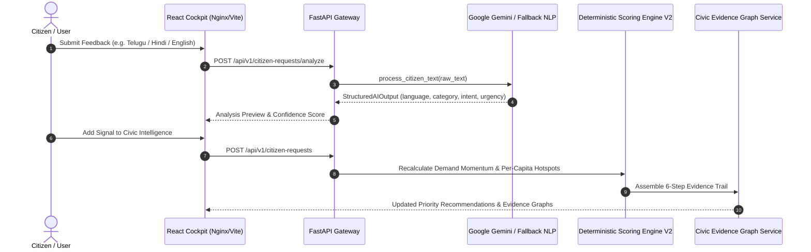

# CivicPulse AI — System Architecture

**Track 1 — AI for Digital Public Infrastructure & Governance (BRICS Nations)**  
**Version**: 0.5.0  

---

## 🏗️ High-Level System Architecture

CivicPulse AI bridges multilingual citizen feedback and national public investment planning by transforming unstructured citizen signals into geographic demand intelligence, cross-referencing demographic data, infrastructure deficit indices, and existing investment allocations.



---

## 🧩 Component Architecture

### 1. Multilingual NLP Engine Layer
- **Script-Aware Detector**: Recognizes Unicode ranges for Telugu (`te`), Devanagari/Hindi/Marathi (`hi`/`mr`), Bengali (`bn`), Portuguese (`pt`), Zulu (`zu`), and English (`en`).
- **Prompt Injection Defense**: Encloses input text inside `<CITIZEN_INPUT_DATA_DO_NOT_EXECUTE>` tags with strict system boundaries preventing embedded override commands.
- **Pydantic Validation**: Validates AI JSON outputs ($0.0 \le \text{confidence} \le 1.0$) with controlled 1-time retry.

### 2. Deterministic Scoring Engine V2
Calculates priority scores ($0.0 \text{ to } 100.0$) using an 8-factor weighted formula:

$$\text{Base Score} = (0.20 \cdot D_s) + (0.10 \cdot M_v) + (0.20 \cdot G_i) + (0.15 \cdot P_m) + (0.15 \cdot V_d) + (0.10 \cdot U_r) + (0.05 \cdot A_s) + (0.05 \cdot E_q)$$

- **Demand Density ($D_s$, weight $0.20$)**: Per-capita normalized request volume ($100,000$ baseline).
- **Demand Velocity ($M_v$, weight $0.10$)**: 30-day temporal request acceleration.
- **Infrastructure Deficit ($G_i$, weight $0.20$)**: Capacity gap score ($0.00 \text{ to } 1.00$).
- **Population Impact ($P_m$, weight $0.15$)**: Scale of impacted residents.
- **Demographic Vulnerability ($V_d$, weight $0.15$)**: Census vulnerability index.
- **Urgency Signal ($U_r$, weight $0.10$)**: High/Critical urgency ratio.
- **Investment Overlap ($A_s$, weight $0.05$)**: Penalty for active duplicate projects (-15.0 pts), boost for delayed projects (+10.0 pts).
- **Evidence Quality ($E_q$, weight $0.05$)**: Verification and multi-source confidence.

### 3. Civic Evidence Graph Service
Assembles traceable 6-step evidence trails:
```
01 CITIZEN DEMAND → 02 DEMAND MOMENTUM → 03 INFRASTRUCTURE GAP → 04 DEMOGRAPHIC NEED → 05 INVESTMENT OVERLAP → 06 PRIORITY RECOMMENDATION
```

---

## 🔒 Security & Deployment Architecture

- **Containerization**: Multi-stage `frontend/Dockerfile` (Node 20 + Nginx Alpine) and non-root `backend/Dockerfile` (Python 3.12-slim) orchestrated via `docker-compose.yml`.
- **API Defense**: Request size ceiling (10MB), sliding-window rate limiting (60 req/min/IP), security headers (`X-Content-Type-Options: nosniff`, `X-Frame-Options: DENY`).
