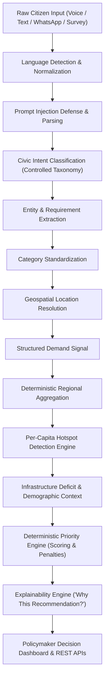

# CivicPulse AI Architecture

## Overview
CivicPulse AI is structured as a decoupled monorepo containing a Python/FastAPI backend and a React/TypeScript frontend. It acts as a Digital Public Good decision-support tool for infrastructure planning across BRICS nations.

---

## 🔄 End-to-End Citizen Demand Intelligence Pipeline

---

## 🏗️ Modular Service Architecture

### 1. Centralized Controlled Taxonomy (`app/core/taxonomy.py`)
- Defines 15 standardized civic infrastructure categories (`healthcare`, `education`, `transportation`, `roads`, `water`, `sanitation`, `electricity`, `digital_connectivity`, `public_safety`, `housing`, `environment`, `waste_management`, `public_services`, `accessibility`, `other`).
- Alias mapping resolves multilingual terms (e.g. `"पानी"`, `"अस्पताल"`, `"esgoto"`, `"água"`, `"amanzi"`) to canonical taxonomy keys.

### 2. Ingestion & Multilingual AI (`app/services/ai_service.py`)
- Provider-independent interface `BaseLanguageIntelligenceProvider` implemented by `GeminiLanguageIntelligenceProvider` and `RuleBasedLanguageIntelligenceProvider`.
- Enforces strict Pydantic structured output validation (`StructuredAIOutput`).
- Includes automatic retry logic and diagnostic logging without key leakage.
- **Prompt Injection Safeguards**: Untrusted citizen feedback is strictly isolated inside `<CITIZEN_INPUT_DATA_DO_NOT_EXECUTE>` tags with explicit instructions preventing model manipulation.

### 3. Location Intelligence (`app/services/location_service.py`)
- Resolves location strings and geographic coordinates to BRICS target regions using Haversine distance.
- Operates 100% offline using seeded region data, with clean interfaces for future geocoding providers.

### 4. Demand Aggregation & Hotspots (`app/services/demand_engine.py` & `app/services/hotspot_engine.py`)
- Deterministic Python statistical aggregation calculating source breakdown, category distribution, urgency levels, and regional demand.
- **Per-Capita Hotspot Engine**: Normalizes demand signals per 100,000 residents ($\frac{\text{Weighted Demand}}{\text{Population}} \times 100,000$) to highlight high-density deficit areas regardless of absolute population size.

### 5. Prioritization & Explainability Engine (`app/services/scoring_engine.py`)
- Deterministic multi-factor scoring function:
  $$\text{Base Score} = 0.25 D_s + 0.25 G_i + 0.15 P_m + 0.15 V_d + 0.10 U_r + 0.10 A_s$$
- Deducts penalties for active duplicate capital investments (-15 pts) and high baseline coverage (>75%).
- Generates machine-readable factor contribution breakdowns (`ExplanationDetails`) for transparency.

### 6. What-If Scenario Simulator (`app/services/scenario_service.py`)
- Simulates post-intervention priority score deltas, gap reductions, and population impact for budget allocations.
