# CivicPulse AI — Civic Evidence Graph Architecture

## Executive Summary
CivicPulse AI bridges citizen voices and public capital investment planning using a **Civic Evidence Graph**. Unlike generic chatbots or complaint counters, CivicPulse AI guarantees that every priority recommendation is traceable through a 6-step evidence trail:

```
CITIZEN SIGNAL → DEMAND MOMENTUM → INFRASTRUCTURE GAP → DEMOGRAPHIC CONTEXT → INVESTMENT ALIGNMENT → PRIORITY RECOMMENDATION
```

---

## 🏛️ Evidence Graph Topology & Pipeline Diagram

```mermaid
flowchart TD
    subgraph Inputs ["Data Ingress & Normalization Layer"]
        A1["Citizen Signals (Voice / Text / WhatsApp)"]
        A2["Demographic Census Indicators"]
        A3["Infrastructure Capacity Audits"]
        A4["Public Capital Budget Records"]
    end

    subgraph Intelligence ["Deterministic Intelligence Engines"]
        B1["NLP Language & Category Taxonomy Parser"]
        B2["Demand Momentum Velocity Engine"]
        B3["Demographic Need Relevance Engine"]
        B4["Investment Overlap & Alignment Engine"]
        B5["Per-Capita Demand Hotspot Engine"]
    end

    subgraph Graph ["Civic Evidence Graph Layer"]
        C1["EvidenceItem: Citizen Demand"]
        C2["EvidenceItem: Demand Velocity"]
        C3["EvidenceItem: Infrastructure Gap"]
        C4["EvidenceItem: Demographic Context"]
        C5["EvidenceItem: Investment Overlap"]
        C6["EvidenceItem: Urgency & Quality"]
    end

    subgraph Priority ["Scoring & Decision Layer"]
        D1["Priority Engine V2 (8 Deterministic Factors)"]
        D2["Deterministic Threshold Classification (CRITICAL / HIGH / MEDIUM / LOW)"]
        D3["WhyThisRecommendation Evidence Trail Assembler"]
    end

    subgraph Output ["Explainable Output Layer"]
        E1["Gemini AI Explanation Boundary (Natural Language Summarization)"]
        E2["REST API Endpoints & Policymaker Dashboard"]
    end

    Inputs --> Intelligence
    Intelligence --> Graph
    Graph --> Priority
    Priority --> Output
```



---

## 📊 Priority Engine V2 Scoring Formula

The final priority score for an infrastructure sector in a region is calculated deterministically:

$$\text{Priority Score} = \min\left(100, \max\left(0, \text{Base Score} - \text{Risk Penalties}\right)\right)$$

### 1. Base Score Dimensions (Sum = 1.00)

$$\text{Base Score} = (0.20 \cdot D_s) + (0.10 \cdot M_v) + (0.20 \cdot G_i) + (0.15 \cdot P_m) + (0.15 \cdot V_d) + (0.10 \cdot U_r) + (0.05 \cdot A_s) + (0.05 \cdot E_q)$$

| Factor | Description | Weight |
|---|---|---|
| $D_s$ (Citizen Demand Signal) | Severity-weighted request count normalized (0-100) | $0.20$ |
| $M_v$ (Demand Velocity Momentum) | Temporal 30-day velocity signal ($+15\%$ = `INCREASING`) | $0.10$ |
| $G_i$ (Infrastructure Gap) | Measured operational capacity deficit ($100 \times \text{gap\_score}$) | $0.20$ |
| $P_m$ (Population Impact) | Log-scaled resident population size | $0.15$ |
| $V_d$ (Demographic Need) | Category-specific census vulnerability index | $0.15$ |
| $U_r$ (Urgency Signal) | NLP emergency severity tags (`CRITICAL`=90, `HIGH`=60) | $0.10$ |
| $A_s$ (Investment Alignment) | Absence of active duplicate capital investment bonus | $0.05$ |
| $E_q$ (Evidence Quality) | Statistical completeness confidence | $0.05$ |

### 2. Risk Modifiers & Penalties

* **Active Investment Penalty**: $-15$ points if an active project (`status: active`) already targets the sector in that region.
* **High Coverage Penalty**: $-0.20 \times \text{coverage\_ratio\_pct}$ if baseline coverage exceeds $75\%$.
* **Delayed Project Exception**: Delayed projects do NOT deduct points; instead, they trigger an explicit risk flag and boost priority urgency for policy intervention.

### 3. Priority Levels
- **80.0 – 100.0**: `CRITICAL`
- **65.0 – 79.9**: `HIGH`
- **45.0 – 64.9**: `MEDIUM`
- **0.0 – 44.9**: `LOW`

---

## 🤖 AI Boundary & Security Safeguards

1. **Strict Deterministic Authority**: All scores, metrics, rankings, and evidence chain steps are generated purely in Python code. **Google Gemini is NEVER allowed to invent statistics or alter scores**.
2. **Prompt Injection Boundary**: Citizen inputs are wrapped inside `<CITIZEN_INPUT_DATA_DO_NOT_EXECUTE>` tags to prevent instructions inside citizen feedback from hijacking AI execution.
3. **Structured Explanation Validation**: AI-generated explanations are passed only validated evidence structures and checked before being returned.
